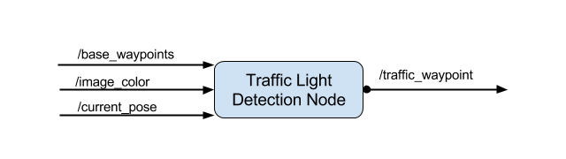

# Programming a real Self-driving car

## Project introduction
For this project, you'll be writing ROS nodes to implement core functionality of the autonomous vehicle system, including traffic light detection, control, and waypoint following! You will test your code using a simulator, and when you are ready, your group can submit the project to be run on Carla.

The following is a system architecture diagram showing the ROS nodes and topics used in the project. You can refer to the diagram throughout the project as needed. The ROS nodes and topics shown in the diagram are described briefly in the Code Structure section below, and more detail is provided for each node in later classroom concepts of this lesson.


## Code Structure

This project includes three ROS nodes. Below is a brief overview of the repo structure, along with descriptions of the ROS nodes. The code that you will need to modify for the project will be contained entirely within the (path_to_project_repo)/ros/src/ directory. Within this directory, you will find the following ROS packages:

### Waypoint Updater Node

This package contains the waypoint updater node: waypoint_updater.py. The purpose of this node is to update the target velocity property of each waypoint based on traffic light and obstacle detection data. This node will subscribe to the /base_waypoints, /current_pose, /obstacle_waypoint, and /traffic_waypoint topics, and publish a list of waypoints ahead of the car with target velocities to the /final_waypoints topic.


The /base_waypoints topic publishes a list of all waypoints for the track, so this list includes waypoints both before and after the vehicle (note that the publisher for /base_waypoints publishes only once). For this step in the project, the list published to /final_waypoints should include just a fixed number of waypoints currently ahead of the vehicle:

The first waypoint in the list published to /final_waypoints should be the first waypoint that is currently ahead of the car. The total number of waypoints ahead of the vehicle that should be included in the /final_waypoints list is provided by the LOOKAHEAD_WPS variable in waypoint_updater.py.

From here, the messages contain a header and a Waypoint list named waypoints. Each waypoint has pose and twist data, where twist.twist data contains 3D linear and angular velocities.

### Drive-By-Wire Node

Carla is equipped with a drive-by-wire (dbw) system, meaning the throttle, brake, and steering have electronic control. This package contains the files that are responsible for control of the vehicle: the node dbw_node.py and the file twist_controller.py, along with a pid and lowpass filter that you can use in your implementation. The dbw_node subscribes to the /current_velocity topic along with the /twist_cmd topic to receive target linear and angular velocities. Additionally, this node will subscribe to /vehicle/dbw_enabled, which indicates if the car is under dbw or driver control. This node will publish throttle, brake, and steering commands to the /vehicle/throttle_cmd, /vehicle/brake_cmd, and /vehicle/steering_cmd topics.


DBW can be toggled by clicking "Manual" in the simulator GUI.

Within the twist controller package, you will find the following:

dbw_node.py

This python file implements the dbw_node publishers and subscribers. You will need to write ROS subscribers for the /current_velocity, /twist_cmd, and /vehicle/dbw_enabled topics. This file also imports the Controller class from twist_controller.py which will be used for implementing the necessary controllers. The function used to publish throttle, brake, and steering is publish.

Note that throttle values passed to publish should be in the range 0 to 1, although a throttle of 1 means the vehicle throttle will be fully engaged. Brake values passed to publish should be in units of torque (N*m). The correct values for brake can be computed using the desired acceleration, weight of the vehicle, and wheel radius.

twist_controller.py

This file contains a stub of the Controller class. You can use this class to implement vehicle control. For example, the control method can take twist data as input and return throttle, brake, and steering values. Within this class, you can import and use the provided pid.py and lowpass.py if needed for acceleration, and yaw_controller.py for steering. Note that it is not required for you to use these, and you are free to write and import other controllers.

yaw_controller.py

A controller that can be used to convert target linear and angular velocity to steering commands.

pid.py

A generic PID controller that can be used in twist_controller.py.

lowpass.py

A generic low pass filter that can be used in lowpass.py.

### Traffic Light detaction Node

This package contains the traffic light detection node: tl_detector.py. This node takes in data from the /image_color, /current_pose, and /base_waypoints topics and publishes the locations to stop for red traffic lights to the /traffic_waypoint topic.

The /current_pose topic provides the vehicle's current position, and /base_waypoints provides a complete list of waypoints the car will be following.

You will build both a traffic light detection node and a traffic light classification node. Traffic light detection should take place within tl_detector.py, whereas traffic light classification should take place within ../tl_detector/light_classification_model/tl_classfier.py.



### Traffic Light classification

We used SSD network which is recommended by Object Detection Lab the version that we used is SSD Inception V2 COCO 2017/11/17.

We followed the instruction from [Step by Step TensorFlow Object Detection API Tutorial](https://medium.com/@WuStangDan/step-by-step-tensorflow-object-detection-api-tutorial-part-1-selecting-a-model-a02b6aabe39e). To:

1. Detact traffic light from picture
2. Train the model to classcify red, green, yellow from the picture.

The trained data are stored in frozen_inference_graph.pb, which is used to classify real time picture from the simulator. 

## Traffic lignt detaction results

The car can drive alone the waypoints. The self driving can and detact and response to red, green and yellow traffic lights.


## Enviroment installation from Udacity

This is the project repo for the final project of the Udacity Self-Driving Car Nanodegree: Programming a Real Self-Driving Car. For more information about the project, see the project introduction [here](https://classroom.udacity.com/nanodegrees/nd013/parts/6047fe34-d93c-4f50-8336-b70ef10cb4b2/modules/e1a23b06-329a-4684-a717-ad476f0d8dff/lessons/462c933d-9f24-42d3-8bdc-a08a5fc866e4/concepts/5ab4b122-83e6-436d-850f-9f4d26627fd9).


Please use **one** of the two installation options, either native **or** docker installation.

### Native Installation

* Be sure that your workstation is running Ubuntu 16.04 Xenial Xerus or Ubuntu 14.04 Trusty Tahir. [Ubuntu downloads can be found here](https://www.ubuntu.com/download/desktop).
* If using a Virtual Machine to install Ubuntu, use the following configuration as minimum:
  * 2 CPU
  * 2 GB system memory
  * 25 GB of free hard drive space

  The Udacity provided virtual machine has ROS and Dataspeed DBW already installed, so you can skip the next two steps if you are using this.

* Follow these instructions to install ROS
  * [ROS Kinetic](http://wiki.ros.org/kinetic/Installation/Ubuntu) if you have Ubuntu 16.04.
  * [ROS Indigo](http://wiki.ros.org/indigo/Installation/Ubuntu) if you have Ubuntu 14.04.
* Download the [Udacity Simulator](https://github.com/udacity/CarND-Capstone/releases).

### Docker Installation
[Install Docker](https://docs.docker.com/engine/installation/)

Build the docker container
```bash
docker build . -t capstone
```

Run the docker file
```bash
docker run -p 4567:4567 -v $PWD:/capstone -v /tmp/log:/root/.ros/ --rm -it capstone
```

### Port Forwarding
To set up port forwarding, please refer to the "uWebSocketIO Starter Guide" found in the classroom (see Extended Kalman Filter Project lesson).

### Usage

1. Clone the project repository
```bash
git clone https://github.com/udacity/CarND-Capstone.git
```

2. Install python dependencies
```bash
cd CarND-Capstone
pip install -r requirements.txt
```
3. Make and run styx
```bash
cd ros
catkin_make
source devel/setup.sh
roslaunch launch/styx.launch
```
4. Run the simulator

### Real world testing
1. Download [training bag](https://s3-us-west-1.amazonaws.com/udacity-selfdrivingcar/traffic_light_bag_file.zip) that was recorded on the Udacity self-driving car.
2. Unzip the file
```bash
unzip traffic_light_bag_file.zip
```
3. Play the bag file
```bash
rosbag play -l traffic_light_bag_file/traffic_light_training.bag
```
4. Launch your project in site mode
```bash
cd CarND-Capstone/ros
roslaunch launch/site.launch
```
5. Confirm that traffic light detection works on real life images

### Other library/driver information
Outside of `requirements.txt`, here is information on other driver/library versions used in the simulator and Carla:

Specific to these libraries, the simulator grader and Carla use the following:

|        | Simulator | Carla  |
| :-----------: |:-------------:| :-----:|
| Nvidia driver | 384.130 | 384.130 |
| CUDA | 8.0.61 | 8.0.61 |
| cuDNN | 6.0.21 | 6.0.21 |
| TensorRT | N/A | N/A |
| OpenCV | 3.2.0-dev | 2.4.8 |
| OpenMP | N/A | N/A |

We are working on a fix to line up the OpenCV versions between the two.
